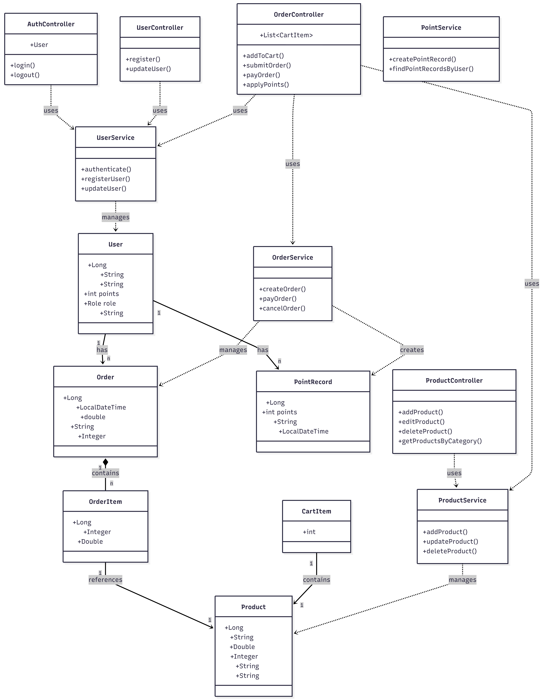

# 基于 Java EE 的在线商城系统 (Java EE Online Mall)


> **课程名称**：专业综合实训课程  
> **指导教师**：刘犇  
> **开发团队**：孙彬祺 (224010119) / 林兴博 (224010117)  
> **班级**：计算机科学与技术 2班  

---

## 📚 核心交付物导航 (Deliverables)

本项目采用 **AI Native（Code by AI, Curated by Human）** 模式开发，以下是完整、可审计的过程交付物：

- **🧠 [ME-log.md（心理执行日志）](./ME-log.md)**  
  记录策展人对 AI 生成代码的业务逻辑解释、幻觉修正（如 User 实体绑定修复）及验证与确认（V&V）过程。
- **🤖 [AI-log.md（AI 交互日志）](./AI-log.md)**  
  包含完整 Prompt 历史与 AI 协作迭代记录，确保生成过程可追溯。
- **📄 [项目文档 /docs](./docs/)**  
  包含项目分析初稿、设计初稿与详细设计文档。

---

## 🛠️ 项目简介 (Introduction)

本项目基于 **Java EE** 技术栈实现了一个功能完整的 **B2C 在线商城系统**。  
系统突破传统线下销售的地域限制，实现了用户管理、商品管理、订单交易及积分激励等核心业务功能。

### 🌟 核心功能
1. **用户管理**
   - 用户注册、登录
   - 管理员 / 普通用户角色区分
   - 个人信息维护
2. **商品管理**
   - 管理员商品 CRUD（名称、价格、库存、图片）
   - 用户商品浏览与查询
3. **订单系统**
   - 购物车
   - 下单、支付、取消
   - 订单状态流转：`PENDING → PAID → CANCELED`
4. **积分激励系统**
   - 获取规则：消费 **10 元 = 1 积分**
   - 抵扣规则：**100 积分 = 1 元**

---

## 🏗️ 技术架构 (Technical Architecture)

系统采用标准 **MVC 分层架构**，保证模块解耦、职责清晰：

| 层级 | 技术方案 | 说明 |
|----|----|----|
| 表现层 (View) | JSF (JavaServer Faces) | `.xhtml` 页面，负责页面展示与用户交互 |
| 控制层 (Controller) | CDI (Managed Beans) | 业务调度、依赖注入，如 `OrderController` |
| 持久层 (Model) | JPA (Hibernate) | ORM 映射，操作 MySQL |
| Web 容器 | Tomcat 11 | 系统运行环境 |

---

## 🔄 系统流程与结构设计 (System Design Overview)

### 🧭 系统业务流程图
展示系统从 **用户登录 → 商品浏览 → 下单 → 支付 → 积分结算** 的完整业务闭环：


---

### 🧩 系统类图（核心领域模型）
展示核心实体及其关系，体现系统的领域建模设计：

- `User`
- `Product`
- `Order`
- `OrderItem`
- `PointRecord`



> 流程图用于验证业务完整性，类图用于验证实体设计一致性，二者共同支撑 AI Native 模式下的人工策展决策。

---

## 💾 数据库设计 (Database Schema)

系统基于 **MySQL 8.0**，共设计 5 张核心业务表：

- `users`：用户信息与角色
- `products`：商品信息与库存
- `orders`：订单主表
- `order_items`：订单明细
- `point_records`：积分变动记录


---

## 🚀 快速开始 (Quick Start)

### 环境要求
- JDK 17+
- Tomcat 11
- MySQL 8.0+
- Maven 3.8+

### 部署步骤

1. **克隆仓库**
```bash
git clone https://github.com/2421380971sun/OnlineShop.git
````

2. **数据库初始化**

* 创建数据库 `mydb`
* 执行 `/sql/init.sql`
* 修改 `src/main/resources/META-INF/persistence.xml` 数据库配置

3. **构建与部署**

```bash
mvn clean package
# 将生成的 war 包部署至 Tomcat/webapps
```

---

## 📅 项目里程碑 (Milestones)

| 时间         | 阶段目标      | 关键成果                |
| ---------- | --------- | ------------------- |
| Week 16 周五 | 基础环境与用户模块 | JPA/CDI 环境搭建，完成登录注册 |
| Week 17 周二 | 商品与交易模块   | 商品 CRUD，购物车，下单流程    |
| Week 17 周三 | 积分与最终交付   | 积分抵扣、订单状态流转、页面优化    |

---

## 👨‍💻 策展人说明 (Curator Note)

在 AI Native 模式下，本项目对 AI 生成代码进行了严格的 **心理执行（Mental Execution）**：

* **逻辑验证**：审查积分抵扣算法，防止精度丢失或循环错误
* **幻觉修正**：修正 User 实体属性绑定错误、枚举不匹配问题
* **冗余治理**：删除 AI 生成的冗余页面 `product_list_user.xhtml`

详细过程记录见：[ME-log.md](./ME-log.md)

---

## 📜 许可证 (License)

本项目基于 **MIT License** 开源。


